# FIRST RAIN ATTEMPT 🌈

##### VIDEO TUTORIAL By : [RED STAPLER](https://www.youtube.com/channel/UCRthRrv06q1iOl86-tTKJhg)

<br>

## Basic Boilerplate 🍦

<br>

```javascript
import React, { Component } from "react";
import * as THREE from "three";
//
//
// the size of the scene (the black square)
const style = {
  height: 600, // we can control scene size by setting container dimensions
};
//
//
class RainTest1 extends Component {
  componentDidMount() {}
  //
  componentWillUnmount() {}
  //
  // 1
  sceneSetup = () => {};
  //
  // 2
  addCustomSceneObjects = () => {};
  //
  // 3
  startAnimationLoop = () => {};
  //
  //
  //
  render() {
    return (
      <div className="scene-oblivion">
        <div
          className="modelBleOne"
          style={style}
          ref={(ref) => (this.eleModelBlOne = ref)}
        ></div>
      </div>
    );
  }
}

export default RainTest1;
```

<br>

# BUILDING THE SCENE 🌈

#### But Before, what is Frustum?

[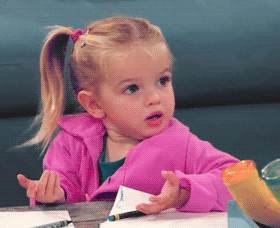]()

- In geometry, a frustum (plural: frusta or frustums) is the portion of a solid (normally
  a cone or pyramid) that lies between one or two parallel
  planes cutting it. A right frustum is a parallel truncation of a
  right pyramid or right cone.

  <br>

[VISUALIZATION: surface-area-of-frustum-of-cone](https://www.geeksforgeeks.org/program-for-volume-and-surface-area-of-frustum-of-cone/)

##### Example:

- The right circular cone after being cut by a plane parallel to its base results in a frustum as follows:

[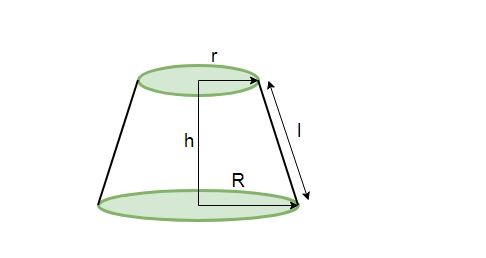]()

> which has a circular base at bottom of radius **R**

> circular upper portion with radius **r**

> height **h**

> and slant height **l**

<br>
<br>

# 🚀 🚀 🚀

<br>

```javascript
import React, { Component } from "react";
import * as THREE from "three";
//
//
const style = {
  height: 600, // we can control scene size by setting container dimensions
};
//
//
class TropicalVoid extends Component {
  componentDidMount() {
    this.sceneSetup();
    this.addCustomSceneObjects();
    this.startAnimationLoop();

    //
    window.addEventListener("resize", this.handleWindowResize);
  }
  //
  //
  componentWillUnmount() {
    window.removeEventListener("resize", this.handleWindowResize);
    window.cancelAnimationFrame(this.requestID);
    this.controls.dispose();
  }
  //
  //
  // 1
  sceneSetup = () => {
    const width = this.eleModelBlOne.clientWidth;
    const height = this.eleModelBlOne.clientHeight;
    //
    //
    //
    this.scene = new THREE.Scene();
    //
    //
    this.camera = new THREE.PerspectiveCamera(
      // 60 degrees field of View
      60,
      window.innerWidth / window.innerHeight,
      1,
      1000
    );
    // using current viewport aspect ratio ( window.innerWidth / window.innerHeight),
    // 1, near plane
    //   1000 unit viewing frustum
    /*
    
    In geometry, a frustum (plural: frusta or frustums) is the portion of a solid (normally 
        a cone or pyramid) that lies between one or two parallel 
    planes cutting it. A right frustum is a parallel truncation of a 
    right pyramid or right cone.
    
    https://www.geeksforgeeks.org/program-for-volume-and-surface-area-of-frustum-of-cone/
    */
    //
    //----------------
    // Set the rotation camera looking UP to the sky
    //
    this.camera.position.z = 1;
    //
    this.camera.rotation.x = 1.16;
    this.camera.rotation.y = -0.12;
    this.camera.rotation.z = -0.27;
    //

    //
    this.renderer = new THREE.WebGL1Renderer();
    this.renderer.setSize(width, height);
    this.eleModelBlOne.appendChild(this.renderer.domElement); // mount using React ref
  };

  // 2
  addCustomSceneObjects = () => {
    // ------------------
    //      LIGHTS
    // ------------------
    //
    //
    // a
    // This light will illuminate all objects of the scene, from all the directions
    const ambient = new THREE.AmbientLight(0x555555);
    this.scene.add(ambient);
    //
    //
    // b This light will represent a MOONlight in the sky
    const directionalLight = new THREE.DirectionalLight(0xffeedd); //0x  then the hex color ,ex: ffffff for white
    directionalLight.position.set(0, 0, 0); // it means that it stands totally at the center
    this.scene.add(directionalLight);
    //
  };

  // 3
  startAnimationLoop = () => {};
  //
  //
  handleWindowResize = () => {
    const width = this.eleModelBlOne.clientWidth;
    const height = this.eleModelBlOne.clientHeight;

    //
    // updated renderer
    this.renderer.setSize(width, height);
    //
    // updated **camera** aspect ratio
    this.camera.aspect = width / height;
    //
    //
    // That is the Three.js optimization: you can group multiple camera changes into a block with only one
    this.camera.updateProjectionMatrix();
  };
  //
  //
  render() {
    return (
      <div className="scene-oblivion">
        <div
          className="modelBleOne"
          style={style}
          ref={(ref) => (this.eleModelBlOne = ref)}
        ></div>
      </div>
    );
  }
}

export default TropicalVoid;
```

##### How it should look like:

[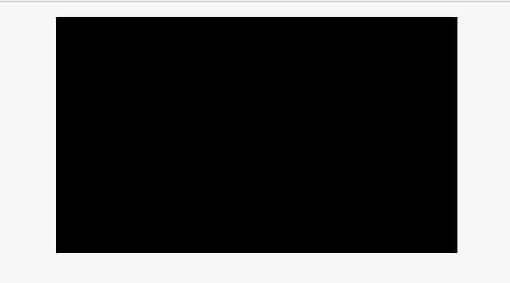]()

<br>
<br>
<br>

# 🍨 CLOUDS

### After the scene is ready, start by adding some clouds

#### But before...

- Lets get rid of the Orbitscontrol so to have a better view of the process

- Also **Just read the code** to familiarize with it, then check the last code at the bottom of the page.

<br>

[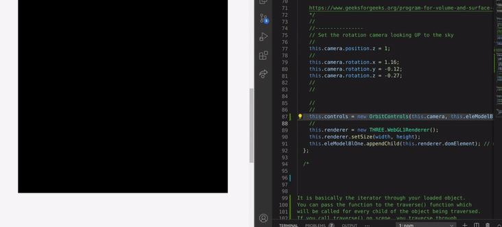]()

<br>
<br>
<br>

# 👾

#### SET UP THE **TEXTURE loader**

<br>

```javascript
let loader = new THREE.TextureLoader();
//1 adding the callback function
loader.load("./images/img-cloud2.png", (texture) => {
  //
  //2 Here below: we will create a geometry for each cloud
  //   500 units plane square

  this.cloudGeo = new THREE.PlaneBufferGeometry(500, 500);
  //3   Then create a Material and a map it with  a texture: (texture) => {
  this.cloudMaterial = new THREE.MeshLambertMaterial({
    map: texture,
    transparent: true,
  });
  //
  //
  //
  // 4 Create a Loop, to randomly add each cloud to the SCENE
  for (let p = 0; p < 25; p++) {
    //
    // 5 First create a cloud OBJ from the geometry and material (above: in step2)
    this.cloud = new THREE.Mesh(this.cloudGeo, this.cloudMaterial);
    // 6 Then randomly SET the position
    this.cloud.position.set(
      Math.random() * 800 - 400,
      500,
      Math.random() * 500 - 450
    );
    //
    // 7 I will set the cloud rotation angle to FACE the camera
    //
    this.cloud.rotation.x = 1.16;
    this.cloud.rotation.y = -0.12;
    //
    // 8 also add random around the Z-axis
    this.cloud.rotation.z = Math.random() * 360;
    // 9 add opacity
    this.cloud.material.opacity = 0.6;
    //
    //
    this.scene.add(this.cloud);
  }

  this.scene.add(texture.scene);
});
```

<br>

##### the code:

[check the whole code](./src/docs/CLOUDSETUP.md)

<br>
<hr>
<br>

# 🚀 🚀 🚀

<br>

## ANIMATING The Scene

#### Add the following:

- **cloudParticles** This is keeping a reference to each cloud in the array

```javascript
this.cloudParticles = [];
//  I Included the cloudParticles inside the addCustomSceneObjects = () => { ,because on top of the file (near the imports) it didn't work.
```

<br>

### Now add the cloudParticles to the Animation Function 🔥

```javascript
// this.cloud.material.opacity = 0.6;
this.cloudParticles.push(this.cloud);
// this.scene.add(this.cloud);
```

<br>

### THEN in the animate function, use the Array to rotate them one by one

```javascript
startAnimationLoop = () => {
  this.cloudParticles.forEach((p) => {
    //   Here  ...
  });
};
```

<br>

### ADD the requestAnimationFrame and the Renderer

```javascript
startAnimationLoop = () => {
  this.cloudParticles.forEach((p) => {
    p.rotation.z -= 0.002;
  });

  //
  // You need the following 2 lines to launch the animation
  this.renderer.render(this.scene, this.camera);
  this.requestID = window.requestAnimationFrame(this.startAnimationLoop);
};
```

##### RESULT

[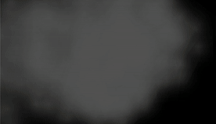]()

<br>
<br>
<br>

# 🚀 🚀 🚀

<br>

# FLASHLIGHTS

- 1 Set up a **point Light with Blue Color**

- 2 You will **position it BEHIND a cloud**

- 3 And **add it to the Scene**

<br>

```javascript
// ----------------
//   FLASH Lights
// ---------------
// add a bluelight 0x062d89 or red ff0000 or purple b600c7
//
this.flash = new THREE.PointLight(0xb600c7, 30, 500, 1.7); //1.7 intensity
//  You will position it BEHIND a cloud
this.flash.position.set(200, 300, 100);
// and added it to the scene
this.scene.add(this.flash);
```

##### RESULT

[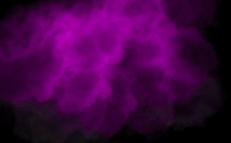]()

<br>
<br>
<br>

### 🔥🔥🔥

## ANIMATE the FlashLight

- Add a Logic to random a Position and Light intensity

- You can change these number in the **If** condition , to **adjust frequency** and lightning intensity

```javascript
// -----------------------
// ANIMATE the FlashLight
// -----------------------
if (Math.random() > 0.93 || this.flash.power > 100) {
  if (this.flash.power < 100)
    this.flash.position.set(
      Math.random() * 400,
      300 + Math.random() * 200,
      100
    );
  this.flash.power = 50 + Math.random() * 500;
}
// -----------------------
```

<br>
<br>
<br>

# 🦄

### Lets make a [Purple Rain](https://www.youtube.com/watch?v=TvnYmWpD_T8)

[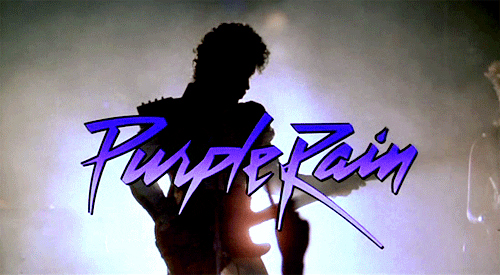]()

<br>

# ADDING THE RAIN

- This is going to be different from adding a cloud, **We are not going to create a separated Object for each Raindrop** , that would be very inefficient and you migh get a framerate drop instead.

```javascript
//
//
//
// ------------------
// a     RAIN
// ------------------
//
this.rainCount = 15000;

//
// ------------------
// b     RAIN drops
// ------------------
//
this.rainGeo = new THREE.Geometry();
for (let i = 0; i < this.rainCount; i++) {
  this.rainDrop = new THREE.Vector3(
    Math.random() * 400 - 200,
    Math.random() * 500 - 250,
    Math.random() * 400 - 200
  );
  this.rainGeo.vertices.push(this.rainDrop);
}
//
// ------------------
// c     CREATE Rain Material
// ------------------
//
this.rainMaterial = new THREE.PointsMaterial({
  color: 0xaaaaaa,
  size: 0.1,
  transparent: true,
});
//
// ------------------
// d     CREATE Rain Object
// ------------------

//
this.rain = new THREE.Points(this.rainGeo, this.rainMaterial);
this.scene.add(this.rain);
//
//
//
```

#### The particles are there but you must to zoom on the images or change the setting in the rain Material from 0.01 to 1 (just to test)

[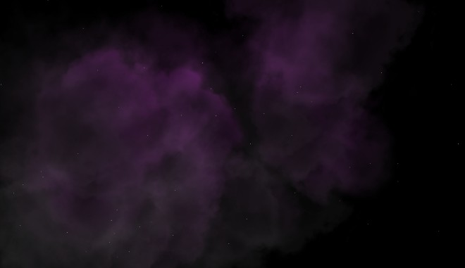]()

<br>
<br>
<br>

# 🦄

## ANIMATE THE RAIN

#### Add the rain Animation (first step ) _**inside the LOOP**_

<br>

- **Here you will add Velocity** property **to each** raindrop

- **then in the animate function**, we will move each drop and increase the,

- the **velocity to simulate the gravity**, also reset the position

```javascript
// ------------------
// b     RAIN
// ------------------
//
// this.rainGeo = new THREE.Geometry();
for (let i = 0; i < this.rainCount; i++) {
  //   this.rainDrop = new THREE.Vector3(
  //     Math.random() * 400 - 200,
  //     Math.random() * 500 - 250,
  //     Math.random() * 400 - 200
  //   );
  //   //
  // --------------------
  // e     rainAnimation
  // --------------------
  // Here you will add Velocity property to each raindrop
  // then in the animate function, we will move each drop and increase the,
  // the velocity to simulate the gravity, also reset the position

  this.rainDrop.velocity = {}; //add this
  this.rainDrop.velocity = 0; // and this
  //
  this.rainGeo.vertices.push(this.rainDrop);
}
```

#### the **velocity to simulate the gravity**, also reset the position

```javascript
startAnimationLoop = () => {
  //
  this.rainGeo.vertices.forEach((p) => {
    p.velocity -= 0.1 + Math.random() * 0.1;
    p.y += p.velocity;
    if (p.y < -200) {
      p.y = 200;
      p.velocity = 0;
    }
  });
  this.rainGeo.verticesNeedUpdate = true;
};
```

[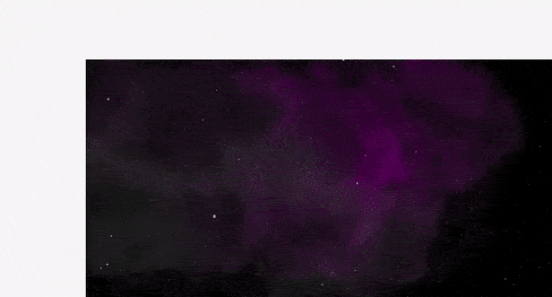]()

<br>
<br>
<br>

# ☁️ ☁️ ☁️

# FOG 🌈

- THE FOG isn't necessary but just by curiosity I will add it

- I am not too much into Fog in the scene, because when i use the models it blocks my computer

<br>

#### Start by adding this under the renderer

```javascript
sceneSetup = () => {
  this.renderer = new THREE.WebGL1Renderer();
  // ------------------
  // f     FOG
  // ------------------
  //
  this.scene.fog = new THREE.FogExp2(0x1c1c2a, 0.002);
  this.renderer.setClearColor(this.scene.fog.color);
  //
  //
  // this.controls = new OrbitControls(this.camera, this.eleModelBlOne);
};
```

### Now animate it

- **GO** INSIDE THE animation function

```javascript
  startAnimationLoop = () => {
    //   FOG
    // This rotation here will serve to add some sort of cinematic effect
    this.rain.rotation.y += 0.002;
    //
    //
```

##### result

[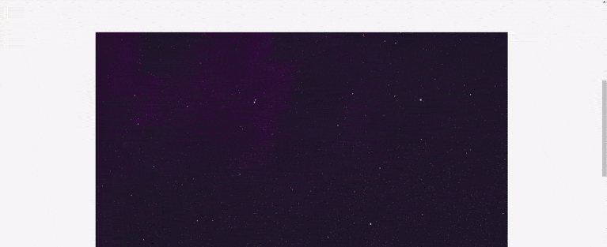]()

<br>
<br>
<br>
<br>
<br>
<br>

### THE CODE

```javascript
import React, { Component } from "react";
import * as THREE from "three";
//
// import { OrbitControls } from "three/examples/jsm/controls/OrbitControls";

const style = {
  height: 600, // we can control scene size by setting container dimensions
};
//

//
//
class TropicalVoid extends Component {
  componentDidMount() {
    this.sceneSetup();
    this.addCustomSceneObjects();
    this.startAnimationLoop();

    //
    window.addEventListener("resize", this.handleWindowResize);
  }
  //
  //
  componentWillUnmount() {
    window.removeEventListener("resize", this.handleWindowResize);
    window.cancelAnimationFrame(this.requestID);
    // this.controls.dispose();
  }
  /*


  */
  // 1
  sceneSetup = () => {
    const width = this.eleModelBlOne.clientWidth;
    const height = this.eleModelBlOne.clientHeight;
    //
    //
    //
    this.scene = new THREE.Scene();
    //
    //
    this.camera = new THREE.PerspectiveCamera(
      // 60 degrees field of View
      60,
      window.innerWidth / window.innerHeight,
      1,
      1000
    );
    // using current viewport aspect ratio ( window.innerWidth / window.innerHeight),
    // 1, near plane
    //   1000 unit viewing frustum
    //  https://www.geeksforgeeks.org/program-for-volume-and-surface-area-of-frustum-of-cone/

    //
    //
    //
    //----------------                  --------------
    // Set the rotation camera looking UP to the sky
    //----------------                  --------------
    //
    this.camera.position.z = 1;
    //rotation
    this.camera.rotation.x = 1.16;
    this.camera.rotation.y = -0.12;
    this.camera.rotation.z = -0.27;
    //
    //
    this.renderer = new THREE.WebGL1Renderer();
    // ------------------
    // f     FOG
    // ------------------
    //
    this.scene.fog = new THREE.FogExp2(0x1c1c2a, 0.002);
    this.renderer.setClearColor(this.scene.fog.color);
    //
    //
    // this.controls = new OrbitControls(this.camera, this.eleModelBlOne);
    this.renderer.setSize(width, height);
    this.eleModelBlOne.appendChild(this.renderer.domElement); // mount using React ref
  };

  /*

 
  


  */
  // 2
  addCustomSceneObjects = () => {
    //
    //-------- 1* cloudParticles
    this.cloudParticles = [];

    // ------------------
    //      LIGHTS
    // ------------------
    //
    // This light will illuminate all objects of the scene, from all the directions
    const ambient = new THREE.AmbientLight(0x555555);
    this.scene.add(ambient);
    //
    //
    // This light will represent a MOONlight in the sky
    const directionalLight = new THREE.DirectionalLight(0xffeedd); //0x  then the hex color ,ex: ffffff for white
    directionalLight.position.set(0, 0, 0); // it means that it stands totally at the center
    this.scene.add(directionalLight);
    //
    // ----------------
    //   FLASH Lights
    // ---------------
    // add a bluelight 0x062d89 or red ff0000 or purple b600c7
    this.flash = new THREE.PointLight(0xb600c7, 30, 500, 1.7); //1.7 intensity .. 0 is really strong
    //  You will position it BEHIND a cloud
    this.flash.position.set(200, 300, 100);
    // and added it to the scene
    this.scene.add(this.flash);
    //
    //
    // ------------------
    // a     RAIN  ***
    // ------------------
    //
    this.rainCount = 15000;

    //
    // ------------------
    // b     Rain
    // ------------------
    //
    this.rainGeo = new THREE.Geometry();
    for (let i = 0; i < this.rainCount; i++) {
      this.rainDrop = new THREE.Vector3(
        Math.random() * 400 - 200,
        Math.random() * 500 - 250,
        Math.random() * 400 - 200
      );
      //
      // --------------------
      // e     rainAnimation
      // --------------------
      // Here you will add Velocity property to each raindrop

      this.rainDrop.velocity = {};
      this.rainDrop.velocity = 0;
      //
      this.rainGeo.vertices.push(this.rainDrop);
    }

    // ------------------
    // c     CREATE Rain Material
    // ------------------
    //
    this.rainMaterial = new THREE.PointsMaterial({
      color: 0xaaaaaa,
      size: 0.3,
      transparent: true,
    });
    //
    // ------------------
    // d     CREATE Rain Object
    // ------------------

    //
    this.rain = new THREE.Points(this.rainGeo, this.rainMaterial);
    this.scene.add(this.rain);
    //
    //
    // ---------------------------
    //  ***  Texture Loader   ***
    // ---------------------------
    //
    //
    //
    let loader = new THREE.TextureLoader();
    // You can change the image of the cloud and have a different outcome everytime you do it
    loader.load("./images/smoke-1.png", (texture) => {
      this.meshyAnimationVar = texture.scene;
      //
      this.cloudGeo = new THREE.PlaneBufferGeometry(500, 500);
      this.cloudMaterial = new THREE.MeshLambertMaterial({
        map: texture,
        transparent: true,
      });
      //
      //
      // if (model.material) model.material.metalness = 0.08;
      for (let p = 0; p < 25; p++) {
        this.cloud = new THREE.Mesh(this.cloudGeo, this.cloudMaterial);
        this.cloud.position.set(
          Math.random() * 800 - 400,
          500,
          Math.random() * 500 - 450
        );
        //
        this.cloud.rotation.x = 1.16;
        this.cloud.rotation.y = -0.12;
        this.cloud.rotation.z = Math.random() * 360;
        this.cloud.material.opacity = 0.6;
        // ------------------  2* cloudParticles
        // the cloud Particles
        this.cloudParticles.push(this.cloud);
        //-------------------
        //
        this.scene.add(this.cloud);
      }
      //
      this.scene.add(texture.scene);
    });
    //
    //
    //
  };

  /*


  */
  // 3
  startAnimationLoop = () => {
    // ------------------  3* cloudParticles
    // the cloud Particles
    this.cloudParticles.forEach((p) => {
      p.rotation.z -= 0.002;
    });
    // --------------------   ****** rainAnimation LOOP
    //s then in the animate function, we will move each drop and increase the,
    // the velocity to simulate the gravity, also reset the position
    //
    this.rainGeo.vertices.forEach((p) => {
      //
      // also reset the position if they are outside the screen
      p.velocity -= 0.1 + Math.random() * 0.1;

      p.y += p.velocity;
      if (p.y < -200) {
        p.y = 200;
        p.velocity = 0;
      }
    });
    this.rainGeo.verticesNeedUpdate = true;
    // --------------------   ****** rainAnimation LOOP
    //   FOG
    // This rotation here will serve to add some sort of cinematic effect
    this.rain.rotation.y += 0.002;
    //
    //
    //
    // -----------------------
    // ANIMATE the FlashLight
    // -----------------------
    if (Math.random() > 0.93 || this.flash.power > 100) {
      if (this.flash.power < 100)
        this.flash.position.set(
          Math.random() * 400,
          300 + Math.random() * 200,
          100
        );
      this.flash.power = 50 + Math.random() * 500;
    }
    // -----------------------

    this.renderer.render(this.scene, this.camera);
    this.requestID = window.requestAnimationFrame(this.startAnimationLoop);
  };
  /*


  */
  handleWindowResize = () => {
    const width = this.eleModelBlOne.clientWidth;
    const height = this.eleModelBlOne.clientHeight;
    // updated renderer
    this.renderer.setSize(width, height);
    //
    // updated **camera** aspect ratio
    this.camera.aspect = width / height;
    // That is the Three.js optimization: you can group multiple camera changes into a block with only one
    this.camera.updateProjectionMatrix();
  };

  /*


  */
  render() {
    return (
      <div className="scene-oblivion">
        <div
          className="modelBleOne"
          style={style}
          ref={(ref) => (this.eleModelBlOne = ref)}
        ></div>
      </div>
    );
  }
}

export default TropicalVoid;
```

[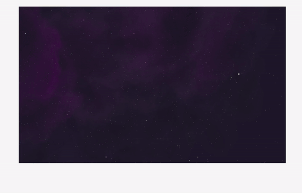](https://www.youtube.com/watch?v=1bkibGIG8i0&list=PLbu98QxRH81KkLTN00OXhD8Y-pRVgTCnM&index=6)

##### VIDEO TUTORIAL By : [RED STAPLER](https://www.youtube.com/channel/UCRthRrv06q1iOl86-tTKJhg)

<br>
<br>
<br>
<br>
<br>
<br>
<br>
<br>

## UNDESIRED  🌵

##### When Allowing {OrbitsControl} you can see the png img corners, I still dont know how to prevent that, as I want to add the rain to the other project i am working on.

[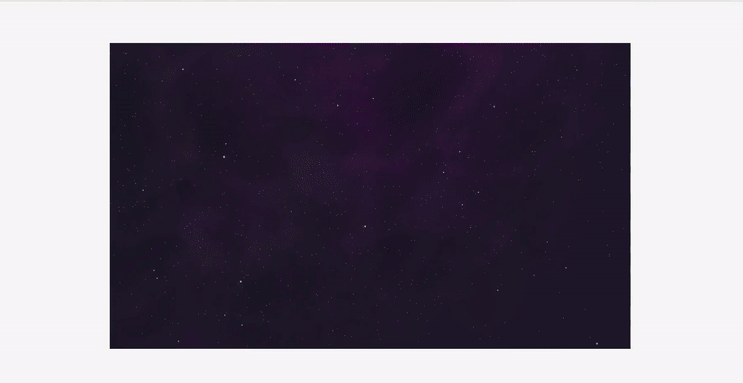]()
